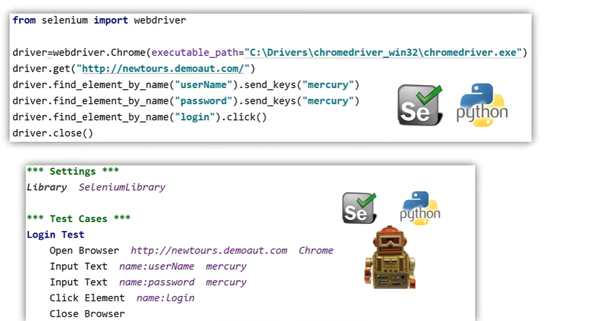

# What is Robot Framework?
* **Robot Framework** is an open-source automation framework primarily used for **acceptance testing**, **acceptance test-driven development (ATDD)**, and **robotic process automation (RPA)**.
* it supports **keyword-driven testing**, making it highly extensible and easy to use for non-developers and developers alike.

# Test Cases - Selenium Vs Robot Framework:
